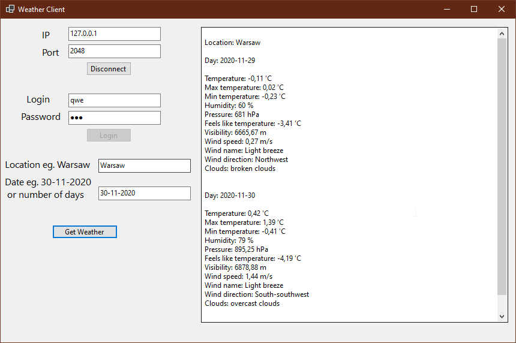

# TCP Server
Asynchronous TCP Server
 
Server fetches weather data from OpenWeatherMap API based on given location eg. warsaw

<ul>
    <li>
        Example communication between server and GUI client:
   </li>                 
 </ul>

 

<ul>
    <li>
        Example communication between server and console client after data being successfully fetched:

        Login: test
        Password: test123
        Account not found, do you want to create new account? (Y/N): y
        Welcome test
        Enter location (Only english letters, exit to disconnect): warszawa

        Fetching data from API

        Location: Warsaw
        Temperature: 9.07 'C
        Max temperature: 10 'C
        Min temperature: 8.33 'C
        Humidity: 99 %
        Pressure: 1017 hPa
        Feels like temperature: 6.7 'C
        Visibility: 10000 m
        Wind speed: 3.05 m/s
        Wind name: Light breeze
        Wind direction: South
        Clouds: overcast clouds
        General weather: overcast clouds

        Enter location (Only english letters, exit to disconnect):

 </ul>
 
 <ul>
    <li>
        Example communication between server and console client after data being unsuccessfully fetched:

        Login: test
        Password: test123
        Welcome test
        Enter location (Only english letters, exit to disconnect): jshdfjsd

        Fetching data from API

        Error: The remote server returned an error: (404) Not Found.

        Enter location (Only english letters, exit to disconnect):

 </ul>  

 <ul>
    <li>
        Example communication between server and console client after using non ASCII chars:

        Login: test
        Password: test123
        Welcome test
        Enter location (Only english letters, exit to disconnect): poznań

        Non ASCII char detected (use only english letters, exit to disconnect), try again

        Enter location (Only english letters, exit to disconnect):
</ul>
