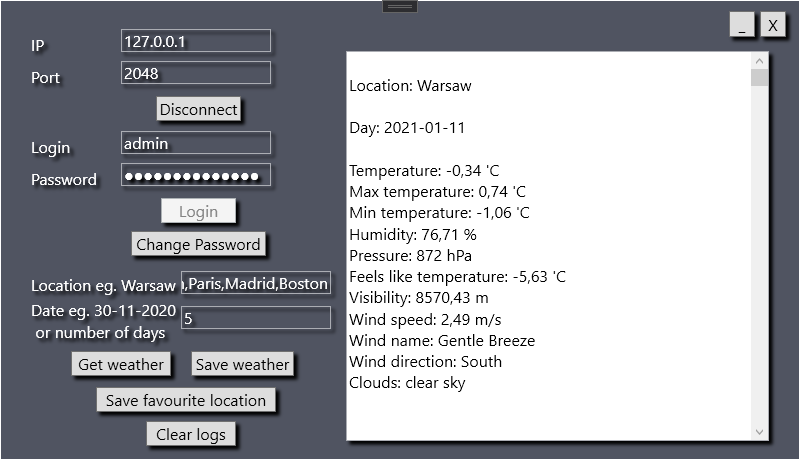
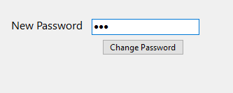
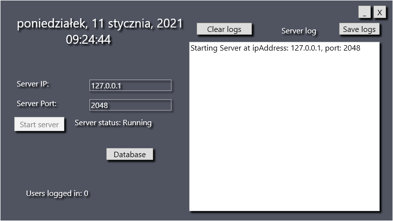
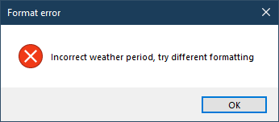
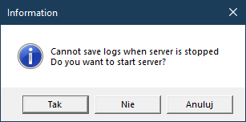
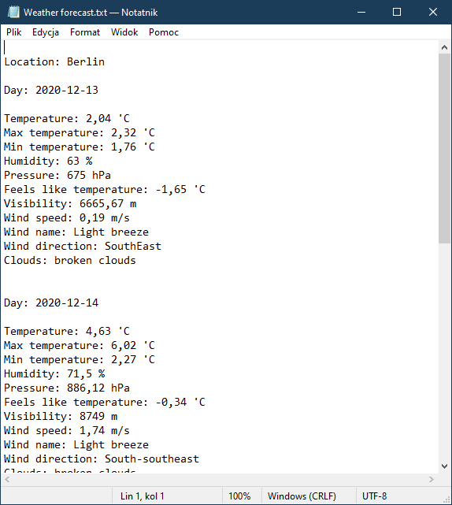

# TCP Server
Asynchronous TCP Server
 
Server fetches weather data from OpenWeatherMap API based on given location eg. warsaw

Both server and client contains exception handling, informing user, asking for decision etc.

Client and Server can save weather and server logs to .txt file

<ul>
    <li>     
        Example communication between GUI server and GUI client:
   </li>                 
 </ul>

 
 
 Connected client can change it's own password for next login
 
 
 
 
 
 Applications provide some user asking methods or informing about exceptions
 
 
 
 
 
 
 
 Weather forecast saved to .txt file
 
 
 
<ul>
    <li>
        Example communication between server and console client after data being successfully fetched:

         Login: testq
         Password: test123
         Account not found, do you want to create new account? (Y/N): y
         Welcome testq
         Enter location (Only english letters, exit to disconnect): warszawa
         Enter days count for weather forecast (1 - 6) or date (eg. 30-11-2020): 02-12-2020

         Fetching data from API

         Location: Warsaw

         Day: 2020-11-29

         Temperature: -0,14 'C
         Max temperature: -0,02 'C
         Min temperature: -0,25 'C
         Humidity: 60 %
         Pressure: 681 hPa
         Feels like temperature: -3,43 'C
         Visibility: 6665,67 m
         Wind speed: 0,27 m/s
         Wind name: Light breeze
         Wind direction: Northwest
         Clouds: broken clouds

         Day: 2020-11-30

         Temperature: 0,42 'C
         Max temperature: 1,39 'C
         Min temperature: -0,41 'C
         Humidity: 79 %
         Pressure: 895,25 hPa
         Feels like temperature: -4,19 'C
         Visibility: 6878,88 m
         Wind speed: 1,44 m/s
         Wind name: Light breeze
         Wind direction: South-southwest
         Clouds: overcast clouds

         Day: 2020-12-01

         Temperature: -0,26 'C
         Max temperature: 1,28 'C
         Min temperature: -1,22 'C
         Humidity: 79 %
         Pressure: 895,12 hPa
         Feels like temperature: -5,4 'C
         Visibility: 8749 m
         Wind speed: 2,22 m/s
         Wind name: Light breeze
         Wind direction: East-southeast
         Clouds: clear sky

         Day: 2020-12-02

         Temperature: -0,88 'C
         Max temperature: 0,53 'C
         Min temperature: -1,94 'C
         Humidity: 80 %
         Pressure: 894,12 hPa
         Feels like temperature: -6,23 'C
         Visibility: 8749 m
         Wind speed: 2,56 m/s
         Wind name: Gentle Breeze
         Wind direction: SouthEast
         Clouds: broken clouds

         Enter location (Only english letters, exit to disconnect):

 </ul>
 
 <ul>
    <li>
        Example communication between server and console client after data being unsuccessfully fetched:

        Login: test
        Password: test123
        Welcome test
        Enter location (Only english letters, exit to disconnect): jshdfjsd
        Enter days count for weather forecast (1 - 6) or date (eg. 30-11-2020): 3

        Fetching data from API

        Error: The remote server returned an error: (404) Not Found.

        Enter location (Only english letters, exit to disconnect):

 </ul>  

 <ul>
    <li>
        Example communication between server and console client after using non ASCII chars:

        Login: test
        Password: test123
        Welcome test
        Enter location (Only english letters, exit to disconnect): poznań
        Enter days count for weather forecast (1 - 6) or date (eg. 30-11-2020): 3
        
        Non ASCII char detected (use only english letters, exit to disconnect), try again

        Enter location (Only english letters, exit to disconnect):
</ul>
